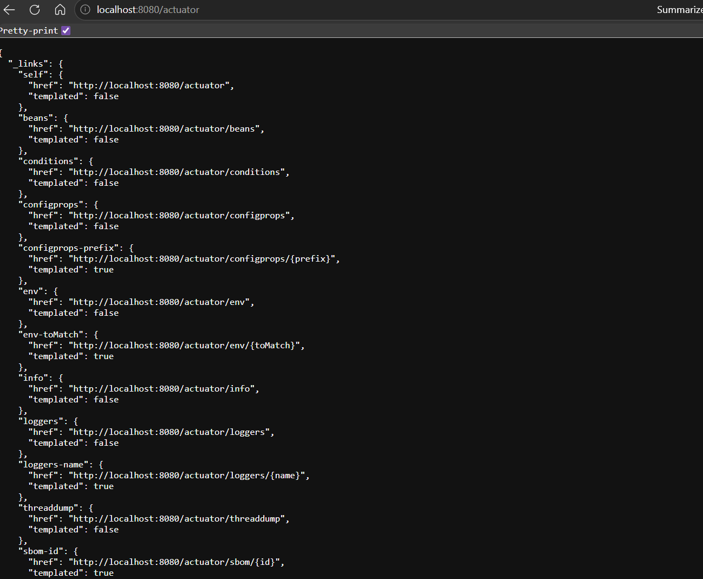

# Projeto Cervejaria

---

## Descrição
API REST desenvolvida em Spring Boot para gerenciamento de cervejarias e cervejas. A aplicação permite CRUD completo sobre cervejarias e cervejas, com documentação via Swagger, monitoramento com Actuator e banco H2 em memória.

---

## Tecnologias
* Linguagem: Java 17
* Framework: Spring Boot 4.0.6
* Banco de Dados: H2 (em memória)
* Mapeamento Objeto-Relacional: Spring Data JPA
* Documentação: springdoc-openapi (Swagger UI)
* Monitoramento: Spring Boot Actuator
* Produtividade: Lombok, Spring Boot DevTools

---

## Estrutura das Entidades

### Cervejaria
Armazena nome, cidade, descrição e informações de contato.
* Relacionamento One-to-Many com Cerveja (cascade ALL)

### Cerveja
Armazena nome, estilo, teor alcoólico (ABV), número de IBU e vínculo Many-to-One com Cervejaria.

---

## Endpoints (resumo)

### Cervejarias (`/breweries`)
* GET /breweries : lista todas as cervejarias (paginado)
* GET /breweries/{id} : recupera cervejaria por ID
* POST /breweries : cria nova cervejaria
* PUT /breweries/{id} : atualiza cervejaria
* DELETE /breweries/{id} : remove cervejaria (cascade nas cervejas)

### Cervejas (`/beers`)
* GET /beers : lista todas as cervejas (paginado)
* GET /beers/{id} : recupera cerveja por ID
* GET /beers/by-brewery/{breweryId} : lista cervejas de uma cervejaria (paginado)
* POST /beers : cria nova cerveja
* PUT /beers/{id} : atualiza cerveja
* DELETE /beers/{id} : remove cerveja

---

## Configuração e Execução
A aplicação utiliza H2 em memória por padrão:
* URL: `jdbc:h2:mem:cervejaria`
* Driver: `org.h2.Driver`
* Dialect: `org.hibernate.dialect.H2Dialect`
* DDL Auto: `update`

Console H2 disponível (`/h2-console`). Swagger UI disponível em `/swagger-ui.html` (springdoc).

Executar localmente (Windows):
```
.\mvnw.cmd spring-boot:run
```
ou empacotar e executar:
```
.\mvnw.cmd package && java -jar target\*.jar
```

---

## Prints do projeto

### Swagger


### Actuator


### Actuator Health


### Actuator Info


---

### CRUD - Brewery

### Post Brewery 


### Get Breweries


### Get Brewery By Id 


### Update Brewery


### Delete Brewery


---

### CRUD - Beer

### Post Beer


### Get Beers


### Get Beer By Id


### Get Beers By Brewery Id


### Update Beer


### Delete Beer
